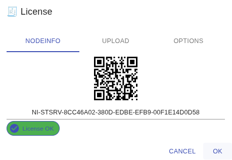

<div align="center">
  <a >
    
  </a>
</div>

# StServer

The **STANAG On Demand Server** is a platform that delivers on-demand and live Full Motion Video (FMV) as well as geospatial metadata to video analysts and field operators. 
This service helps them easily access, analyze, and present mission-critical information, enabling faster decision-making and improved situational awareness. 
The server is designed to support NATO's Standardization Agreement (STANAG) requirements, ensuring compatibility with a range of military systems and applications. 
The server enhances the ability of analysts and operators to effectively monitor and respond to dynamic situations. 
With the **STANAG On Demand Server**, organizations can benefit from a comprehensive, scalable, and reliable solution for managing video and geospatial data.
More [info](https://impleotv.com/products/stanagondemand-server/).

## System Requirements

OS: Linux x64.

## Installation (using Docker Compose)

The **STANAG On Demand Server** is installed as a set of [microservices](https://www.impleotv.com/content/stserver2/help/microservices/microservices_overview/),
with Linux being the preferred operating system. Although the solution can be deployed by directly installing the components, this manual describes a  
method that uses containerization (with Docker) and service orchestration tools. For local server deployment (single host), we will use docker-compose, 
while Kubernetes is more suitable for distributed deployment.

Installation instructions can be found [here](https://www.impleotv.com/content/stserver2/help/user-guide/installation/)


## Direct Download link

|          | Version             | Download link                                                           | 
|:---------|:-------------------:|:------------------------------------------------------------------------|
| **StServer (Linux x64)** |  3.1.4 | [stserver-install.tar.gz](https://github.com/impleotv/stserver-release/releases/download/v3.1.4/stserver-install.tar.gz)  | 
| **StServer (VOD for WSL2)** |  3.1.4 | [stserver-install-wsl.tar.gz](https://github.com/impleotv/stserver-release/releases/download/v3.1.4/stserver-install-wsl.tar.gz)  | 

*Released on Tue, 9 Dec 2025, 10:07 GMT+2*

## Components versions

Current server version uses the following components:  

|                  | Version             | CHANGELOG                                                          | 
|:-----------------|:-------------------:|:------------------------------------------------------------------------|
| **Backend**      |  3.1.4 | [CHANGELOG-SERVER.md](./CHANGELOG-SERVER.md) | 
| **Frontend**     |  3.1.2 | [CHANGELOG-FRONTEND.md](./CHANGELOG-FRONTEND.md) | 
| **FrontendComp** |  1.12.6 | [CHANGELOG-FRONTEND-COMP.md](./CHANGELOG-FRONTEND-COMP.md) | 
  

## Mission uploader

StServer [mission uploader](https://www.impleotv.com/content/stserver2/help/utilities/stserver-uploader/) utility:  

|                  |  CHANGELOG                                                          | 
|:-----------------|:------------------------------------------------------------------------|
| **Mission uploader (Windows x64)**      |  [stserveruploader.zip](https://impleotv.com/content/stserver2/stserveruploader/stserveruploader.zip) | 
| **Mission uploader (Linux x64)**        |  [stserveruploader.gz](https://impleotv.com/content/stserver2/stserveruploader/stserveruploader.gz) | 
  

## License

**STANAG On Demand Server** is a node locked software, so without license it will work in demo mode (with restrictions). 

### License options

StServer optional features are enabled by License

Options:  

- **VOD** - basic license. File upload and video on demand services  
- **Live** - live stream playback  
- **Multi sensor** - multi-sensor platform support  
- **Number of concurrent users** - number of allowed concurrent clients 
- **VOD for StPlayer** - One web client and unlimited number of StPlayer clients.  This one is usually for on VOD playback only  

### Getting license

To obtain a license, please follow these steps:

- Install the server software on your target machine.  
- Complete the [online form](https://docs.google.com/forms/d/e/1FAIpQLSd_XW6bDsFce1G1cpds4gMQNlwNax0CvkWzcMbscxZ5rLaIbA/viewform) and provide the **Node Info** string for the target machine (IMPORTANT!!!).  
If the computer is offline or you’re unable to copy and paste the Node Info for any reason, please take a clear photo of the screen showing the QR code and send it to us.

*Please note that licenses will be issued after the product has been purchased.*



### Uploading license
You will receive a license file (with the .lic extension). Drag and drop it into the ***Upload*** dropzone (or select the file).  

  
You can review the allowed options in the **Options** tab.

> *Your license file is a JWT token. You can see it's content by opening the .lic file in any JWT viewer,  
> for example [JWT.io](https://jwt.io).*

### License file location

Licenses are stored in the folder specified in the .env file and are automatically mounted by the server's Docker container.  
```
LICENSE_DIR=${HOME}/licenses/stserver/
```
It is also possible to simply copy the license to this directory.

> **Note:**  
Make sure that the server has an access rights to read and write to this directory.  
Also, only keep one copy of the license file, the server will use the first one found.


---

## Known issues

- In the version 2.7.1 mongodb was downgraded to version 4.4.18 to allow runnning in the VM. If you're not using VM and have a more recent mongodb version, you can change 

```
  mongodb:
    image: mongo:4.4.18
```   
to 
```
  mongodb:
    image: mongo
```    
You should also do this if you're upgrading the server version and have your DB created with a more recent mongodb version, otherwise it won't work.

- If not restarted after install, first mission upload may fail. Delete the mission and upload again.

----  
*Please don't hesitate to contact us at support@impleotv.com should you have any question.*
