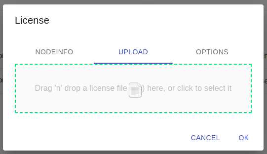

<div align="center">
  <a >
    
  </a>
</div>

# StServer

The **STANAG On Demand Server** is a platform that delivers on-demand and live Full Motion Video (FMV) as well as geospatial metadata to video analysts and field operators. 
This service helps them easily access, analyze, and present mission-critical information, enabling faster decision-making and improved situational awareness. 
The server is designed to support NATO's Standardization Agreement (STANAG) requirements, ensuring compatibility with a range of military systems and applications. 
The server enhances the ability of analysts and operators to effectively monitor and respond to dynamic situations. 
With the **STANAG On Demand Server**, organizations can benefit from a comprehensive, scalable, and reliable solution for managing video and geospatial data.
More [info](https://impleotv.com/products/stanagondemand-server/).

## System Requirements

OS: Linux x64.

## Installation (using Docker Compose)

The **STANAG On Demand Server** is installed as a set of [microservices](https://www.impleotv.com/content/stserver2/help/microservices/microsevices_overview/),
with Linux being the preferred operating system. Although the solution can be deployed by directly installing the components, this manual describes a  
method that uses containerization (with Docker) and service orchestration tools. For local server deployment (single host), we will use docker-compose, 
while Kubernetes is more suitable for distributed deployment.

Installation instructions can be found [here](https://stserver.impleotv.com/help/user-guide/installation/) or [here](https://www.impleotv.com/content/stserver2/help/user-guide/installation/)


## Direct Download link

|          | Version             | Download link                                                           | 
|:---------|:-------------------:|:------------------------------------------------------------------------|
| **StServer (Linux x64)** |  2.5.3 | [stserver-install.tar.gz](https://github.com/impleotv/stserver-release/releases/download/v2.5.3/stserver-install.tar.gz)  | 
| **StServer (VOD for WSL2)** |  2.5.3 | [stserver-install-wsl.tar.gz](https://github.com/impleotv/stserver-release/releases/download/v2.5.3/stserver-install-wsl.tar.gz)  | 

*Released on Tue, 21 Mar, 13:31 GMT+2*

## Components versions

Current server version uses the following components:  

|                  | Version             | CHANGELOG                                                          | 
|:-----------------|:-------------------:|:------------------------------------------------------------------------|
| **Backend**      |  2.5.3 | [CHANGELOG-SERVER.md](./CHANGELOG-FRONTEND.md) | 
| **Frontend**     |  2.4.2 | [CHANGELOG-FRONTEND.md](./CHANGELOG-FRONTEND.md) | 
| **FrontendComp** |  1.5.3 | [CHANGELOG-FRONTEND-COMP.md](./CHANGELOG-FRONTEND-COMP.md) | 
  

## Mission uploader

StServer [mission uploader](https://www.impleotv.com/content/stserver2/help/utilities/stserver-uploader/) utility:  

|                  |  CHANGELOG                                                          | 
|:-----------------|:------------------------------------------------------------------------|
| **Mission uploader (Windows x64)**      |  [stserveruploader.zip](https://impleotv.com/content/stserver2/stserveruploader/stserveruploader.zip) | 
| **Mission uploader (Linux x64)**        |  [stserveruploader.gz](https://impleotv.com/content/stserver2/stserveruploader/stserveruploader.gz) | 
  

## License

**STANAG On Demand Server** is a node locked software, so without license it will work in demo mode (with restrictions). 

### License options

StServer optional features are enabled by License

Options:  

- **VOD** - basic license. File upload and video on demand services  
- **Live** - live stream playback  
- **Multi sensor** - multi-sensor platform support  
- **Number of concurrent users** - number of allowed concurrent clients 
- **VOD for StPlayer** - One web client and unlimited number of StPlayer clients.  This one is usually for on VOD playback only  

### Getting license

In order to get the license, please install the server and fill an [online form](https://docs.google.com/forms/d/e/1FAIpQLSd_XW6bDsFce1G1cpds4gMQNlwNax0CvkWzcMbscxZ5rLaIbA/viewform), providing the ***Node Info*** string (IMPORTANT!!!) for the target machine. Or contact ImpleoTV support.

There are 3 options to install the license:  

- Using GUI frontend to upload the license
- Passing license info as the arguments (with *--licenseFile* and *--licenseKey*)
- Copying license file (.lic) and a key (.txt) file into current working directory **LICENSE_DIR** defined in **.env**


### Uploading license
You will receive 2 files - license file and key file. Simply drag and drop them into the ***Upload*** dropzone.



Licenses are stored in the folder specified in .env file and automatically mounted by the server docker container.
```
LICENSE_DIR=~/licenses/stserver/
```
It is also possible to simply copy the licenses to this directory.

> **Note:**  
Make sure that the server has an access rights to read and write to this directory.  
Also, only keep one copy of the license file and key, the server will use the first one found.


## Known issues for version 2.5.3

- If not restarted after install, first mission upload may fail. Delete the mission and upload again.

----  
*Please don't hesitate to contact us at support@impleotv.com should you have any question.*